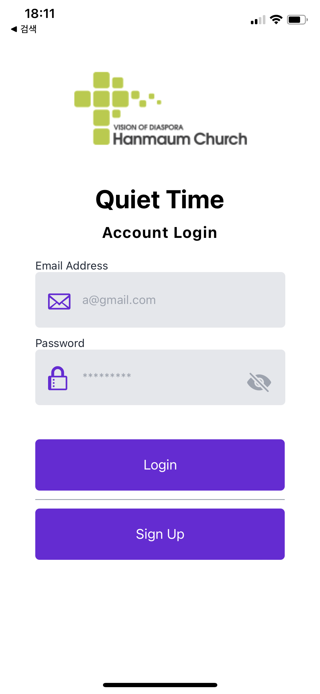
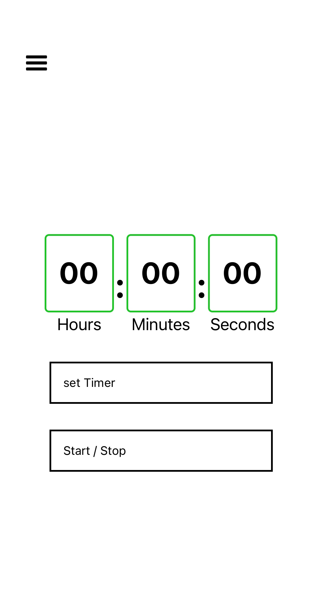
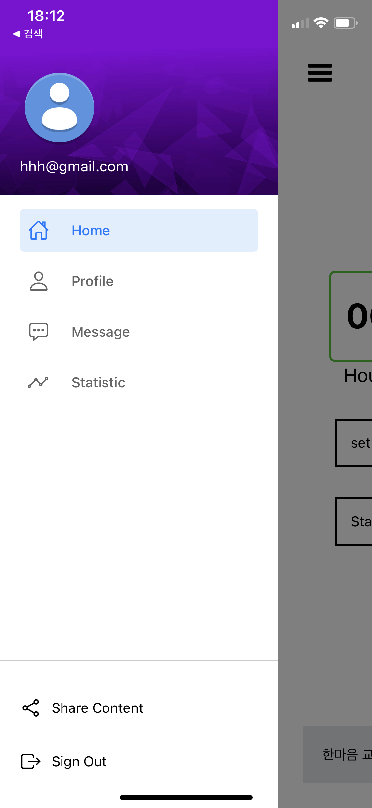

# QT-Reminder-App

### Manage your time 

### Run the App

https://expo.dev/@jin1207/QT-App

test it with expo app.

  
  
  

 

### Version
functions available in

v1: login, signup, count down settings, sign out, drawer 
